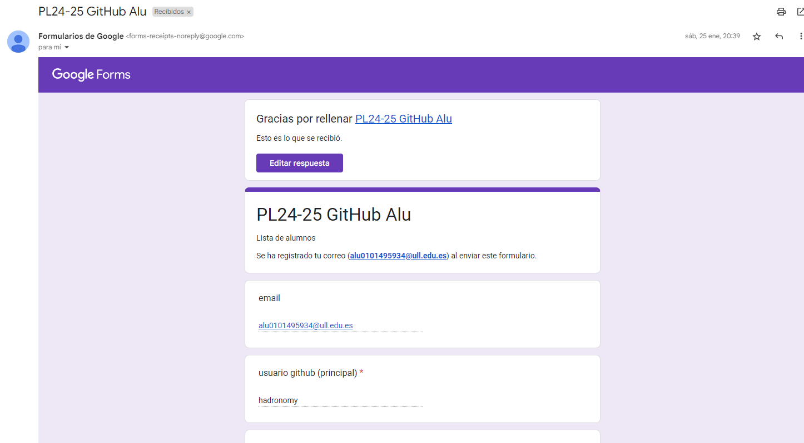
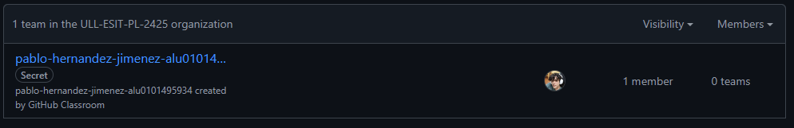
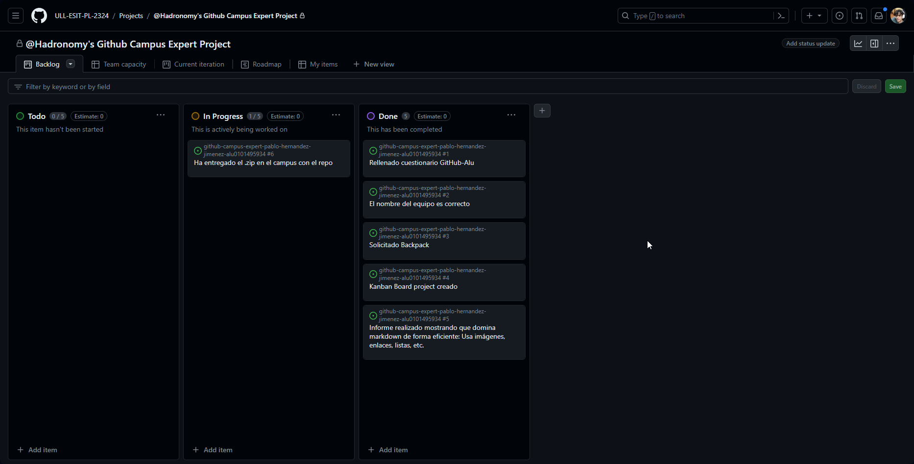

# Github Campus Expert 

- Pablo
- Hernández Jiménez 
- alu0101495934

## Rellenar el cuestionario GitHub-Alu del campus virtual y recibir el correo confirmándolo

## Crear equipo con nombre correcto

## Crear un project board kanban para este repositorio

## Solicitar el GitHub Backpack

> [!IMPORTANT]
> En mi caso llevo usando el **Github Developer Pack** desde
> bachillerato y renovando cada vez que caduca, por lo
> que a la hora de la realización de esta practica ya tenía el
> **Github Developer Pack**

